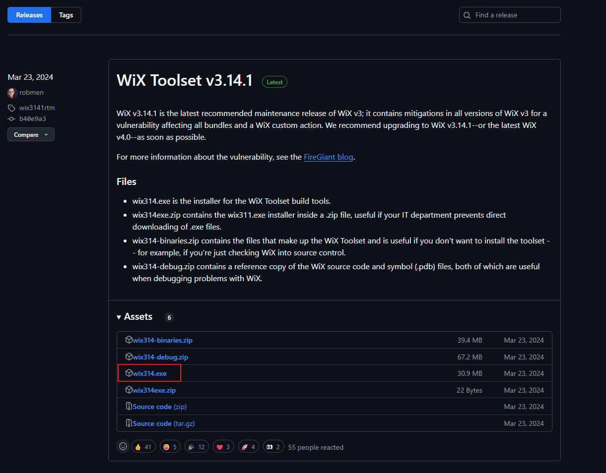
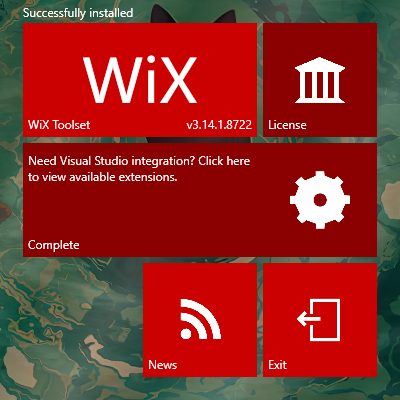
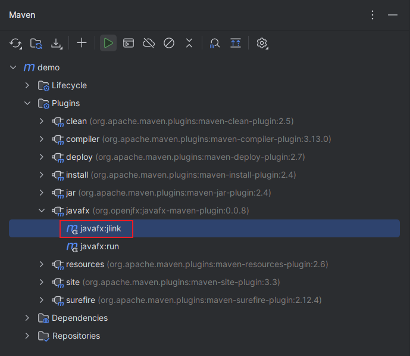
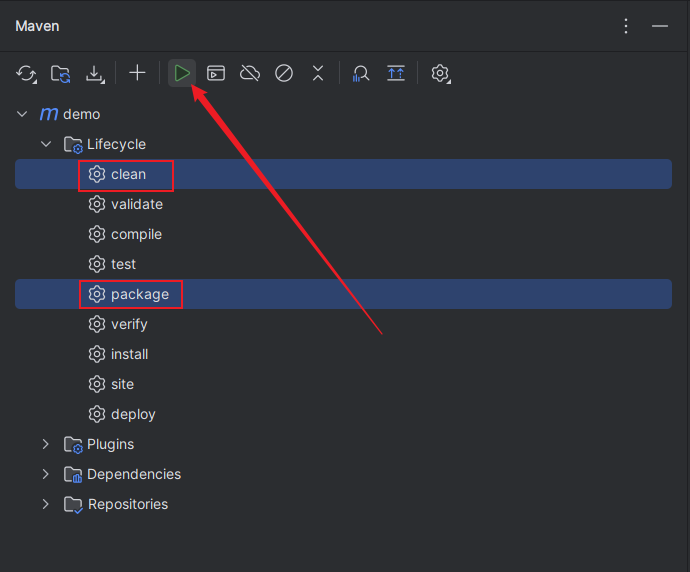
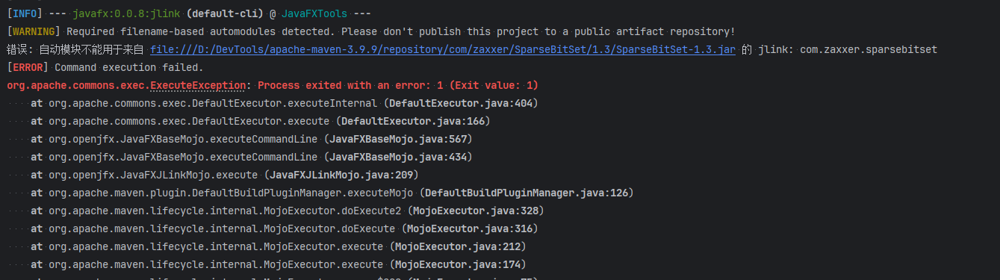
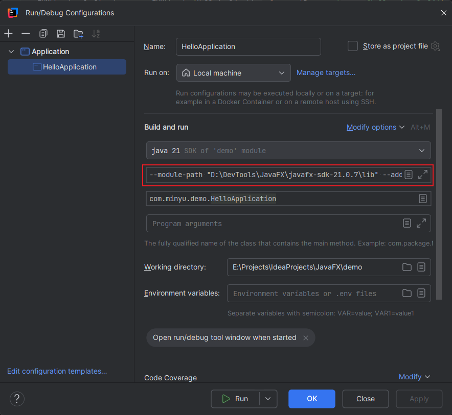

## 1.  概述

自 Java 9 引入模块化系统（JPMS）以来，JavaFX 的打包方式分化为两条截然不同的路线。

- **路线一**：使用`jlink`构建运行时映像（*runtime image*），这个映像会包含你的代码和第三方依赖（并不包含所有依赖，只包含你在`module-inf.java`中声明的模块），因此体积较小，然后基于这个运行时映像构建安装包。
- **路线二**：基于`JAR`包进行构建，这种方式会把使用的所有依赖都打包进来，因此打包的体积会稍大，但是对模块化没有要求，所以兼容性更好，无论你的项目或依赖是否为模块化，都可以走该路线。这条路线又可细分为两种方式：
    - **依赖分离**：将主程序 JAR 与依赖库 JAR 分开存放，结构清晰。
    - **FatJar**：将所有依赖打入一个 JAR 包中。由于现代 JavaFX 项目常结合 Spring Boot 使用，利用 Spring Boot 插件构建 FatJar 既契合框架特性，又极大简化了配置。

| 打包方式                                  | 项目要求                             | 适用场景                                    |
| ------------------------------------- | -------------------------------- | --------------------------------------- |
| [方式一：基于运行时映像](#基于运行时映像构建)             | 必须包含 `module-info.java`，依赖库必须模块化 | 仅推荐纯模块化且无复杂历史依赖的新项目使用，且后续不考虑引入复杂的依赖。    |
| [方式二：基于依赖分离的 JAR 包](#基于依赖分离的JAR包构建) | 无特殊要求                            | 适合**未整合 Spring Boot** 的传统 JavaFX 项目。    |
| [方式三：基于 FatJar 进行构建](#基于FatJar进行构建) | 无特殊要求                            | 适合整合了 **Spring Boot** 的项目，配置最简单，开发体验最好。 |

> [!tip] 关于表格中==适用场景==说明
> **适用场景**只是推荐这样做，实际上，除了方式一有硬性要求，剩下的两种方式，无论你的项目和依赖是否模块化，无论你的项目是否整合了`SpringBoot`都可以使用，这完全看你的心情。

虽然模块化是`Java`的未来，但对于大多数开发者来说，我建议首选**方式二**或**方式三**，这样能避开模块化报错，让你把更多的精力放在程序开发上，用略微增加的体积换取**最大的兼容性和开发效率**。

%% ### 1.2.  jlink与jpackage的关系

无论采用哪种打包方式，`jlink` 和 `jpackage` 实际上都可能被用到。许多初学者容易误解，认为两者是互斥的，或者使用了 `jpackage` 就不再需要 `jlink`。事实上，它们之间是分工明确、相互协作的关系。

在基于可独立运行的 JAR 构建时，`jpackage` 会自动调用 `jlink`，为应用生成一个定制化的运行时环境（runtime image）。不过，这个 `runtime` 中仅包含必要的 JDK 模块（如 java.base、javafx.controls 等），并不包含你的程序代码，本质上是一个“精简版的 JDK”。

如果你希望对运行时进行更精细的控制（如：包含应用模块、排除无关模块等），也可以选择手动使用 `jlink` 构建完整的运行时映像，这个映像包含了你的程序代码，可以通过 `jpackage` 的 `--runtime-image` 参数指定该映像，生成跨平台的安装包。 %%
## 2.  准备工作

### 2.1.  JavaFX的SDK与JMODs

判断自己是否需要下载：

| 打包方式                | 是否需要 JavaFX SDK | 是否需要 JavaFX jmods | 备注                                              |
| ------------------- | --------------- | ----------------- | ----------------------------------------------- |
| 方式一打包               | ❌ 不需要           | ❌ 不需要             |                                                 |
| 方式二/方式三打包（模块化项目）    | ✅ 需要            | ✅ 需要              | 模块化项目使用此方式打包的话`module-info.java`无作用，项目等同于非模块化项目 |
| 方式二/方式三打包（引导类启动）    | 🟡可要可不要         | 🟡可要可不要           | 不要的话，启动有警告，不影响功能，建议下载                           |
| 方式二/方式三打包（SDK 参数启动） | ✅ 需要            | ✅ 需要              | 无警告，官方推荐规范方式                                    |

访问[下载页面](https://gluonhq.com/products/javafx/)，选择对应的JavaFX版本，选择对应的平台。按需下载，下载后解压即可使用。


### 2.2.  安装平台特定工具

#### 2.2.1.  Windows

Windows平台构建安装包时，需要用到 *Wix* ，安装步骤如下：

1. 访问下载页面：[https://github.com/wixtoolset/wix3/releases](https://github.com/wixtoolset/wix3/releases)
2. 双击运行安装程序，点击*Install*
3. 安装完成后如下图所示
4. 验证安装是否成功
	```bash
	candle -help  # 应显示版本信息
	light -help   # 应显示版本信息
	```

#### 2.2.2.  MacOS

无

#### 2.2.3.  Linux

无

## 3.  基于运行时映像构建

1. 打包插件配置（使用 IntelliJ IDEA 创建的JavaFX项目通常默认包含此配置）：
	```xml
    <build>
        <plugins>
            <plugin>
                <groupId>org.apache.maven.plugins</groupId>
                <artifactId>maven-compiler-plugin</artifactId>
                <version>3.13.0</version>
                <configuration>
                    <source>21</source>
                    <target>21</target>
                </configuration>
            </plugin>
            <plugin>
                <groupId>org.openjfx</groupId>
                <artifactId>javafx-maven-plugin</artifactId>
                <version>0.0.8</version>
                <executions>
                    <execution>
                        <!-- Default configuration for running with: mvn clean javafx:run -->
                        <id>default-cli</id>
                        <configuration>
                            <mainClass>com.example/com.example.App</mainClass>
                            <launcher>app</launcher>
                            <jlinkZipName>app</jlinkZipName>
                            <jlinkImageName>app</jlinkImageName>
                            <noManPages>true</noManPages>
                            <stripDebug>true</stripDebug>
                            <noHeaderFiles>true</noHeaderFiles>
                        </configuration>
                    </execution>
                </executions>
            </plugin>
        </plugins>
    </build>
	```

2.  在Maven面板中运行`javafx:jlink`
> [!Warning] 注意
> 如果遇到报错：*错误:自动模块不能用于来自xxx*，说明存在非模块化依赖，参考[6.1章节](#6.1.%20第三方依赖兼容性问题)解决

3. 编写平台打包配置文件（以下示例只包含最基本的参数，请查看[待完善的参数](#待完善的参数)）：
	-  Windows配置（需要提前安装Wix，查看[Wix安装步骤](#Windows)）：
		```plaintext title:package-win.txt
		--name "MyApp"
		--type exe
		--runtime-image target/app
		--module com.example/com.example.App
		--dest dist
		--win-shortcut
		--win-menu
		--win-dir-chooser
		```
	-  MacOS配置：
		```plaintext title:package-mac.txt
		--name "MyApp"
		--type dmg
		--runtime-image target/app
		--module com.example/com.example.App
		--dest dist
		--mac-package-identifier com.example.myapp
		--mac-sign
		```
	-  Linux配置：
		```plaintext title:package-linux.txt
		--name "MyApp"
		--type deb
		--runtime-image target/app
		--module com.example/com.example.App
		--dest dist
		--linux-shortcut
		```

4. 保存文件并执行打包命令
	```bash
	jpackage @package.txt
	```

---

## 4.  基于依赖分离的JAR包构建

> [!Tip] 提示
> 请提前[下载javafx-jmods](https://gluonhq.com/products/javafx/)（按需下载，[判断是否需要下载](#JavaFX的SDK与JMODs)）

1. 打包插件配置
    ```xml
    <build>
        <finalName>MyApp</finalName>
        <plugins>
            <!-- 编译插件 -->
            <plugin>
                <groupId>org.apache.maven.plugins</groupId>
                <artifactId>maven-compiler-plugin</artifactId>
                <version>3.14.0</version>
                <configuration>
                    <source>21</source>
                    <target>21</target>
                </configuration>
            </plugin>
    
            <!-- 依赖插件 -->
            <plugin>
                <groupId>org.apache.maven.plugins</groupId>
                <artifactId>maven-dependency-plugin</artifactId>
                <version>3.8.1</version>
                <executions>
                    <execution>
                        <id>copy-dependencies</id>
                        <phase>prepare-package</phase>
                        <goals>
                            <goal>copy-dependencies</goal>
                        </goals>
                        <configuration>
                            <outputDirectory>${project.build.directory}/lib</outputDirectory>
                            <includeScope>runtime</includeScope>
                        </configuration>
                    </execution>
                </executions>
            </plugin>
    
            <!-- 打包插件 -->
            <plugin>
                <groupId>org.apache.maven.plugins</groupId>
                <artifactId>maven-jar-plugin</artifactId>
                <version>3.4.2</version>
                <configuration>
                    <archive>
                        <manifest>
                            <addClasspath>true</addClasspath>
                            <classpathPrefix>lib/</classpathPrefix>
                            <mainClass>com.example.App</mainClass>
                        </manifest>
                    </archive>
                </configuration>
            </plugin>
    
            <!-- 为jpackage打包创建一个纯净的输入目录 -->
            <plugin>
                <artifactId>maven-antrun-plugin</artifactId>
                <version>3.2.0</version>
                <executions>
                    <execution>
                        <id>prepare-jpackage-input</id>
                        <phase>package</phase>
                        <goals>
                            <goal>run</goal>
                        </goals>
                        <configuration>
                            <target>
                                <delete dir="${project.build.directory}/pure"/>
                                <mkdir dir="${project.build.directory}/pure"/>
                                <copy file="${project.build.directory}/${project.build.finalName}.jar"
                                      tofile="${project.build.directory}/pure/${project.build.finalName}.jar"/>
                                <copy todir="${project.build.directory}/pure/lib">
                                    <fileset dir="${project.build.directory}/lib"/>
                                </copy>
                            </target>
                        </configuration>
                    </execution>
                </executions>
            </plugin>
        </plugins>
    </build>
    ```

2. 在Maven面板中运行`clean`和`package`打包应用
3.  编写平台打包参数文件（以下示例只包含最基本的参数，请查看[待完善的参数](JPackage命令说明.md)）：
	- Windows配置（需要提前安装Wix，查看[Wix安装步骤）：
		```plaintext title:package-win.txt
		--name "MyApp"
		--type exe
		--input target/pure
		--main-jar MyApp.jar
		--main-class com.example.App
		--module-path "%JAVA_HOME%/jmods;%PATH_TO_FX_MODS%"
		--add-modules ALL-MODULE-PATH
		--dest dist
		--win-shortcut
		--win-menu
		--win-dir-chooser
		```
	- MacOS配置：
		```plaintext title:package-mac.txt
		--name "MyApp"
		--type dmg
		--input target/pure
		--main-jar MyApp.jar
		--main-class com.example.App
		--module-path "${JAVA_HOME}/jmods;${PATH_TO_FX_MODS}"
		--add-modules ALL-MODULE-PATH
		--dest dist
		--mac-package-identifier com.example.myapp
		--mac-sign
		```
	- Linux配置：
		```plaintext title:package-linux.txt
		--name "MyApp"
		--type rpm
		--input target/pure
		--main-jar MyApp.jar
		--main-class com.example.App
		--module-path "${JAVA_HOME}/jmods;${PATH_TO_FX_MODS}"
		--add-modules ALL-MODULE-PATH
		--dest dist
		--linux-shortcut
		```

4. 保存文件并执行打包命令
	```bash
	jpackage @package.txt
	```
## 5.  基于FatJar进行构建

> [!Tip] 提示
> 请提前[下载javafx-jmods](https://gluonhq.com/products/javafx/)

1. 打包插件配置
    ```xml
    <build>
        <finalName>MyApp</finalName>
        <plugins>
            <!-- 编译插件 -->
            <plugin>
                <groupId>org.apache.maven.plugins</groupId>
                <artifactId>maven-compiler-plugin</artifactId>
                <version>3.14.0</version>
                <configuration>
                    <source>21</source>
                    <target>21</target>
                </configuration>
            </plugin>
    
            <!-- SpringBoot打包插件 -->
            <plugin>
                <groupId>org.springframework.boot</groupId>
                <artifactId>spring-boot-maven-plugin</artifactId>
                <version>3.5.8</version>
                <configuration>
                    <mainClass>com.example.App</mainClass>
                </configuration>
                <executions>
                    <execution>
                        <goals>
                            <goal>repackage</goal>
                        </goals>
                    </execution>
                </executions>
            </plugin>
    
            <!-- 为jpackage打包创建一个纯净的输入目录 -->
            <plugin>
                <artifactId>maven-antrun-plugin</artifactId>
                <version>3.2.0</version>
                <executions>
                    <execution>
                        <id>prepare-jpackage-input</id>
                        <phase>package</phase>
                        <goals>
                            <goal>run</goal>
                        </goals>
                        <configuration>
                            <target>
                                <delete dir="${project.build.directory}/pure"/>
                                <mkdir dir="${project.build.directory}/pure"/>
                                <copy file="${project.build.directory}/${project.build.finalName}.jar"
                                      tofile="${project.build.directory}/pure/${project.build.finalName}.jar"/>
                            </target>
                        </configuration>
                    </execution>
                </executions>
            </plugin>
        </plugins>
    </build>
    ```

2. 在Maven面板中运行`clean`和`package`打包应用
3.  编写平台打包配置文件（以下示例只包含最基本的参数，请查看[待完善的参数](JPackage命令说明.md)）：
	- Windows（需要提前安装Wix，查看[Wix安装步骤](#7.%20Wix安装教程)）：
		```plaintext title:package-win.txt
		--name "MyApp"
		--type exe
		--input target/pure
		--main-jar MyApp.jar
		--module-path "%JAVA_HOME%/jmods;%PATH_TO_FX_MODS%"
		--add-modules ALL-MODULE-PATH
		--dest dist
		--win-shortcut
		--win-menu
		--win-dir-chooser
		```
	- MacOS：
		```plaintext title:package-mac.txt
		--name "MyApp"
		--type dmg
		--input target/pure
		--main-jar MyApp.jar
		--module-path "${JAVA_HOME}/jmods;${PATH_TO_FX_MODS}"
		--add-modules ALL-MODULE-PATH
		--dest dist
		--mac-package-identifier com.example.myapp
		--mac-sign
		```
	- Linux：
		```plaintext title:package-linux.txt
		--name "MyApp"
		--type rpm
		--input target/pure
		--main-jar MyApp.jar
		--module-path "${JAVA_HOME}/jmods;${PATH_TO_FX_MODS}"
		--add-modules ALL-MODULE-PATH
		--dest dist
		--linux-shortcut
		```

4. 保存文件并执行打包命令
	```bash
	jpackage @package.txt
	```

---

## 6.  第三方依赖兼容性问题

> [!warning] 💬 **问题描述：**
> - 模块化项目中，如果引入了非模块化 JAR（即没有 `module-info.class`），在执行 `javafx:jlink` 构建运行时映像时会报错：
> `错误: 自动模块不能用于来自 xxx 的模块`
>- 🎯 **本质原因：**
>`jlink` 要求项目及其所有依赖都是“显式模块化”的，非模块化 JAR 在模块图构建阶段可能会发生名称冲突、服务不可见等问题。
>

### 6.1.  方案一：使用基于JAR包的方式打包（推荐）

直接使用 [基于依赖分离的JAR包构建](#基于依赖分离的JAR包构建) 或 [基于FatJar进行构建](#基于FatJar进行构建) 这两种方式构建，使用这两种方式构建的话，建议顺手将项目改造为非模块化项目（[查看改造方式](#非模块化项目改造)）。

### 6.2.  方案二：寻找可替换的模块化依赖

若坚持使用 `jlink` 构建精简运行时，建议：

- 尽量**查找官方支持模块化的替代库**
- 没有替代项的，可以**考虑手动实现所需功能**

 ⚠️ 适合依赖较少的项目

### 6.3.  方案三：尝试将依赖模块化（不推荐）

我知道有的人到这里仍不死心，非要想着使用`jlink`构建运行时映像，所以我写了此方案的步骤，供需要的人参考。

> [!warning] 说明：
> 虽然可以通过 [moditect](https://github.com/moditect/moditect) 手动给第三方 JAR 包“强行”注入 `module-info.class`，但在实践中可能会遇到以下问题：
> 
> - ✅ `mvn javafx:jlink` 能通过
> - ❌ 实际运行时失败，提示无法访问某些服务或类（一些第三方框架对模块系统兼容性不佳）
> 
>  ⚠️ 所以 ==**并非模块化成功就能运行成功，如果依赖内部使用了反射/动态代理等机制，在程序运行时可能会失败。**==

**如果你执意要尝试，请参考以下步骤**：

1. 引入[moditect](https://github.com/moditect/moditect)插件；
```xml
<plugin>
	<groupId>org.moditect</groupId>
	<artifactId>moditect-maven-plugin</artifactId>
	<version>1.0.0.RC2</version>
	<executions>
		<execution>
			<phase>generate-resources</phase>
			<goals>
				<goal>add-module-info</goal>
			</goals>
			<configuration>
				<outputDirectory>${project.build.directory}/modules</outputDirectory>
				<!--覆盖重复文件，防止报错-->
				<overwriteExistingFiles>true</overwriteExistingFiles>
				<modules>
					<module>
					    <!-- 配置需要模块化jar的Maven坐标 -->
						<artifact>
							<groupId></groupId>
							<artifactId></artifactId>
							<version></version>
						</artifact>
						<!-- 配置模块声明信息 -->
						<moduleInfoSource>
							
						</moduleInfoSource>
					</module>
				</modules>
			</configuration>
		</execution>
	</executions>
</plugin>
```

2. 获取Maven坐标信息（根据格式定位 `groupId:artifactId:jar:version`）；
```bash
mvn dependency:tree > dependency-tree.txt
```

3. 获取模块声明信息；
```bash
jdeps --ignore-missing-deps --generate-module-info jars Non-module.jar
```
4. 点击Maven插件`javafx:jlink`，生成模块化的JAR包
5. 执行第四步的时候仍然会报错，不过这时我们会看到`target/moditect`目录下生成了模块化的JAR包，这时候还没结束，我们要使用这些模块化的JAR包。
6. 使用模块化的JAR包
	- 方式一（不推荐）：使用模块化的 JAR 替换本地仓库中的非模块化的 JAR（可能会对其它项目造成影响）
		```bash
		copy target/modules/new-modular.jar .m2/repository/non-modular.jar
		```
	- 方式二（推荐）：将模块化后的 JAR 安装到本地仓库，并重新引入：
		```bash
		mvn install:install-file -Dfile="target/modules/new-modular.jar" -DgroupId="com.example" -DartifactId="new-modular"  -Dversion="1.0-modular" -Dpackaging=jar
		```

### 6.4.  方案总结

| 方案                                 | 是否推荐    | 是否保留模块结构 | 是否适用 `jlink` | 风险/难度     |
| ---------------------------------- | ------- | -------- | ------------ | --------- |
| [方案一](#6.1.1.%20方案一：改造为非模块化项目（推荐）) | ✅ 推荐    | 可保留或移除   | 否            | 最低，适合所有项目 |
| [方案二](#6.1.2.%20方案二：寻找可替换的模块化依赖)   | ⚠️ 条件推荐 | 是        | 是            | 中等，需人工干预  |
| [方案三](#6.1.3.%20方案三：尝试将依赖模块化（不推荐）) | ❌ 不推荐   | 是        | 是            | 高，运行失败概率高 |

## 7.  非模块化项目改造

### 7.1.  为什么要改造为非模块化项目？

模块化项目对第三方依赖的 “模块化合规性” 要求严格（需所有依赖都包含`module-info.class`），而多数传统库尚未完成模块化适配。改造为非模块化项目可避开模块化带来的依赖冲突，降低开发和打包复杂度，尤其适合依赖较多的项目。

### 7.2.  改造方式

直接删除项目中的`module-info.java`文件即可完成改造。

```ascii failure:3
my-app/
├── src/main/java/
│   ├── module-info.java   // 模块声明
│   └── com/
│       └── example/
│           ├── App.java
│           └── Controller.java
└── pom.xml
```

> [!Note] 关于`module-info.java`的说明
> 即使不删除`module-info.java`，也可使用基于 JAR 包的打包方式（方式二 / 三），但此时`module-info.java`没有任何作用（等同于非模块化项目）。为避免代码冗余，建议直接删除该文件完成改造。

### 7.3.  改造后的启动方式

删除`module-info.java`后，直接启动主类会因 JVM 无法识别 JavaFX 模块而报错。需通过以下两种方式解决：

#### 7.3.1.  方式一：添加引导类（临时方案）

1. 在主类同级目录创建引导类，间接调用主类：
    ```java
    public class Launcher {
        public static void main(String[] args) {
            App.main(args);
        }
    }
    ```

2. 以`Launcher`为入口启动项目，启动后会有警告。

> [!example] 改造后的项目结构
> 
> ```ascii hint:6
> my-app/
> ├── src/
> │   └── src/main/java
> │       └── example/
> │           ├── App.java
> │           ├── Launcher.java
> │           └── Controller.java
> └── pom.xml
> ```
> 

#### 7.3.2.  方式二：通过 SDK 参数配置（官方推荐）

1. 下载[JavaFX SDK](https://gluonhq.com/products/javafx/)并解压；
2. 配置 JVM 启动参数（以 IDEA 为例，`Alt+V`打开启动配置）
3. 添加参数，保存并运行
    ```plaintext
    --module-path ${PATH_TO_FX} --add-modules javafx.controls,javafx.fxml
    ```

4. 直接以原主类（如`App`）为入口启动。

### 7.4.  两种启动方式的区别
#### 7.4.1.  添加引导类

通过新增一个`Launcher`类间接调用主类（如`Launcher.main()`调用`App.main()`），本质是利用 “类路径优先” 绕过模块检查。但此时 JavaFX 类会被加载到 “未命名模块”（`unnamed module`），与 JavaFX 的模块化设计冲突，因此会出现警告`Unsupported JavaFX configuration`。
#### 7.4.2.  SDK参数配置

通过`--module-path "path/to/javafx-sdk/lib" --add-modules javafx.controls,javafx.fxml`显式指定模块路径和需要加载的模块，完全符合 JavaFX 的运行规范，因此无警告，这也是官方推荐的方式。

---

## 8.  Jpackage打包说明

### 8.1.  打包类型参考

|  **打包类型**   |         **适用操作系统**          |       **格式说明**       |                                         文件扩展名                                          |
| :---------: | :-------------------------: | :------------------: | :------------------------------------------------------------------------------------: |
| `app-image` |     跨平台（通用），生成对应平台的运行程序     |     包含JRE的可执行目录      | <ul><br><li>Windows：.exe</li><br><li>MacOS：.app</li><br><li>Linux：无特定扩展名</li><br></ul> |
|    `exe`    |           Windows           |        传统安装程序        |                                          .exe                                          |
|    `msi`    |           Windows           | Windows Installer安装包 |                                          .msi                                          |
|    `rpm`    | Linux（RHEL/CentOS/Fedora 等） |    Red Hat包管理器格式     |                                          .rpm                                          |
|    `deb`    | Linux（Ubuntu/Debian/Mint 等） |      Debian包格式       |                                          .deb                                          |
|    `pkg`    |            MacOS            |     MacOS 标准安装包      |                                          .pkg                                          |
|    `dmg`    |            MacOS            |        磁盘映像文件        |                                          .dmg                                          |

### 8.2.  命令行VS配置文件

很多开发者仍习惯直接手敲 `jpackage` 命令进行打包配置，这样费劲不说，还容易敲错，推荐的做法是使用参数文件，将命令提前写好放在文件中，然后使用`jpackge @filename`命令进行打包。

那么配置文件用什么格式呢？虽然官方确实没有强制规定文件的后缀名（因为本质上它只是读取文件内容并作为参数解析），但我推荐使用 `.txt`，因为`.txt` 是通用文本格式，无需安装额外的软件就能直接使用记事本打开，反正不管什么后缀名，执行的原理都是一样的。

当然，你也可以选择 `.args`、`.properties` 这类后缀，功能上没有任何区别，纯粹看个人习惯或团队规范即可。

### 8.3.  待完善的参数

上面的打包教程中的**参数配置**较为简短，主要目的是为了让大家能够快速构建一个可用的安装包（因为我认为所有的成功都来源于正反馈，卡太久可能都放弃了），所以实际打包时，大家要根据自己的需求补充参数，比如：

- 应用图标：`--icon`
- JVM 启动参数：`--java-options`
- 一些平台特有的配置

[查看更多参数说明](JPackage命令说明.md)

### 8.4.  更好的方式

虽然配置文件让执行`jpackage`更方便了，但每次打包前仍需手动删除旧的 `dist` 目录，步骤略显繁琐。我们可以写一个批处理脚本，将 “删目录 + 执行打包” 整合起来，后续只需双击脚本，即可自动完成全流程。以Windows为例：

```bat
rd /s /q dist
jpackage @package-win.txt
pause
```

### 8.5.  --input 参数说明

`--input` 参数的核心作用是：将你指定目录下的**所有文件**，完整复制到打包后生成的 `app` 文件夹中。

如果直接将 `--input` 指向项目的 `target` 目录，会导致大量无关文件（如源码 jar、临时构建文件、日志等）被一并打包。这不仅会造成安装包体积臃肿，还会无端占用用户的磁盘空间。

因此，我们需要构建一个**只包含运行所需文件的纯净目录**。这也正是上文配置中 `--input target/pure` 的由来。

**注意**：这一步我已经通过构建插件（见配置列表末尾）替大家自动化处理了，插件会自动将核心 Jar 包提取到 `target/pure` 目录中。大家无需手动操作，只需理解这里的配置意图即可。

### 8.6.  模块配置：--module-path 与 --add-modules

在使用 `jpackage` 打包时，这两个参数用于配置模块化运行时（Runtime）：

- `--module-path`：指定模块查找的**路径**（即 jmods 所在的目录）。
- `--add-modules`：指定需要**添加**到运行时的具体模块名称。

如果你把参数分开写，例如同时指定了 JavaFX 和 JDK 的路径，并且用了 `ALL-MODULE-PATH`：

```plaintext
--module-path "D:/DevTools/JavaFX/javafx-jmods-21.0.7"
--add-modules javafx.controls,javafx.fxml
--module-path "D:/DevTools/Java/jdk-21/jmods"
--add-modules ALL-MODULE-PATH
```

`jpackage` 会自动把这些参数合并起来传给底层的 `jlink`。注意，这里的 `ALL-MODULE-PATH` 是个“贪婪”的指令，它表示“把路径里能找到的模块全都要”。所以，最终生成的 `runtime` 目录里会包含 JDK 和 JavaFX 的**所有模块**，而不仅仅是你写的那几个。

因此，更规范、简洁的写法是把路径用分号拼接：

```plaintext
--module-path "D:/DevTools/JavaFX/javafx-jmods-21.0.7;D:/DevTools/Java/jdk-21/jmods"
--add-modules ALL-MODULE-PATH
```

**总结**：如果你想按需引入（为了包更小），就一个个指定模块名；如果你嫌麻烦且不在乎体积，用 `ALL-MODULE-PATH` 就可以一股脑全打进去。

### 8.7.  JVM参数

可以使用`--java-options`指定JVM运行时参数，例如：

```plaintext
--java-options "-Xmx512m"
--java-options "-Dfile.encoding=UTF-8"
```

也可以合并到一起写：

```plaintext
--java-options "-Xmx512m -Dfile.encoding=UTF-8"
```

一般情况建议合并写，但是下面这种情况需要分开写：比如你需要传递一个包含空格的路径：`-Dlog.path="C:/My App/Logs"`。这个时候和别的参数合并在一起容易出错，这个时候我建议分开写：

```plaintext
--java-options "-Xmx512m -Dfile.encoding=UTF-8"
--java-options "-Dlog.path=\"C:/My App/Logs\""
```

### 8.8.  关于FatJar

FatJar（也称 “胖 JAR”）是将项目代码与所有依赖库合并为单个 JAR 文件的打包方式，其核心优势是**简化部署**—— 只需传输或运行一个 JAR 文件即可启动应用，无需单独管理依赖目录。

在上面的示例中，我使用了`Spring Boot Maven Plugin`这款插件进行打包，除此之外，还有别的插件也能构建 FatJar，例如：`maven-assembly-plugin`，`maven-shade-plugin`。相比之下，还是`Spring Boot Maven Plugin`这款插件更有优势：

> [!Note] SpringBoot插件的优势
> - 避免类冲突​​：传统插件会将所有依赖解压混合，若不同依赖中存在同名文件（如 `module-info.class` 或配置文件），会发生覆盖冲突。Spring Boot 插件直接嵌套 JAR 包，物理隔离，彻底根除此类问题。
> - 保护依赖完整性​​：由于不解压依赖，因此不会破坏第三方库（如加密库 BouncyCastle）的**数字签名**，避免了运行时抛出 `SecurityException` 的风险。
> - 极简配置​​：无需像 Shade 插件那样配置复杂的 `Transformer` 来处理 `META-INF/services` 或 `Manifest` 文件，几乎零配置即开即用。
> - 强大的启动器​​：内置 `JarLauncher` 自动处理类路径（Classpath）加载顺序，完美兼容非 Spring Boot 的普通 Java/JavaFX 项目（所以并非SpringBoot像项目才能使用此插件打包）。

### 8.9.  指定主类

使用 Spring Boot Maven 插件打包时，**通常无需手动指定主类**。这是因为该插件会自动构建符合 Spring Boot 规范的 FatJar，其内部通过`org.springframework.boot.loader.JarLauncher`作为启动入口（负责处理嵌套依赖加载、类路径管理等核心逻辑），并自动关联你在插件配置中声明的`mainClass`（如`com.example.App`）。

若强行通过`jpackage`的`--main-class`参数指定主类，**必须显式设置为`org.springframework.boot.loader.JarLauncher`**（而非你的业务主类），否则会破坏 Spring Boot 的启动机制，导致程序无法运行。因此，对于 Spring Boot 打包的 JAR，建议完全交由插件自动处理主类关联，避免手动指定。

对于其他打包方式（如`maven-jar-plugin`构建的普通 JAR、`maven-assembly-plugin`构建的 FatJar 等），主类的指定逻辑则取决于 JAR 包本身的配置：

- 若 JAR 包的`META-INF/MANIFEST.MF`中已通过`Main-Class`属性声明了主类（如`<mainClass>com.example.App</mainClass>`），则`jpackage`可自动识别，无需额外配置`--main-class`；
- 若`MANIFEST.MF`中未声明主类，则必须在`jpackage`参数中通过`--main-class`明确指定入口类（如`com.example.App`），否则程序启动时会因找不到主类而失败。

## 9.  疑问解答

### 9.1.  JavaFX 依赖的编译时与运行时加载逻辑差异

#### 9.1.1.  开发时依赖 ≠ 运行时模块

为什么项目在 Maven 中已经引入了`javafx-controls`、`javafx-fxml`等依赖，打包时还要通过`--module-path`和`--add-modules`显式指定 JavaFX 模块？

Maven 中引入的 JavaFX 依赖（如`javafx-controls`）的作用是**支撑编译阶段**：确保你在写代码时能引用到`javafx.scene.control.Button`等类，避免编译报错。但这些依赖本质是 “编译时类路径” 的一部分，仅保证代码能编过，不负责**运行时的模块加载**。

JavaFX 的特殊之处在于：它的核心组件（如`javafx.controls`、`javafx.fxml`）属于 Java 的 “可选模块”（未包含在默认 JDK 中），其运行依赖于 Java 的模块化系统（JPMS）。即使你在 Maven 中引入了相关 JAR，JVM 在运行时仍需明确 “这些类属于哪个模块”“需要加载哪些模块”，否则会因找不到模块定义而失败。

#### 9.1.2.  为什么通过引导类启动时又不需要指定呢？

当你通过一个不继承 `Application` 的普通类（即引导类）作为入口启动时，JVM 不会把应用视为一个模块化应用，而是退回到传统的 **类路径模式**。此时，Maven 引入的 JavaFX JAR 包被全部加载到了“类路径”中，而不是“模块路径”中。所有在类路径上的代码都归属于一个巨大的“未命名模块”。

虽然 JVM 允许未命名模块读取所有内容（所以程序能跑起来），但这本质上是绕过了模块系统的安全检查。这就是为什么会看到 `Unsupported JavaFX configuration` 的警告，这是JVM在提醒你："虽然跑起来了，但不合规"。

### 9.2.  打包的应用无法运行

**问题描述**：使用`jpackage`构建各平台的安装包后，无法正常运行或闪退

**排查思路**​​：
1. 修改打包参数中的类型为`app-image`，并删除平台特有的参数；
2. 添加`--verbose`命令；
3. 打包完成后通过 **命令行** 运行程序；
4. 检查错误日志，分析问题并解决；

### 9.3.  能否跨平台打包

不能，虽然JavaFX是跨平台，但是打包的时候，只能在对应的操作系统进行打包，在Windows上无法构建MacOS的安装包，在MacBook上也无法构建Windows的安装包。

### 9.4.  能否构建免安装绿色版

可以。

1. 修改打包参数中的类型为`app-image`，并删除平台特有的参数；
2. 执行打包命令进行打包；
3. 用压缩文件将打包后的文件构建成一个压缩包。

### 9.5.  能否构建单文件应用

可以。这里只告诉大家有哪些方式，不做详细演示，大家有兴趣的话可以自己尝试。

 - 方式一：WinRAR 自解压包（单文件，启动慢）
 - 方式二：exe4j/launch4j（依赖系统 JDK，无法在没有JDK的设备上运行）
 - 方式三：Enigma Virtual Box（封装目录为单文件，首次启动极慢）
 - 方式四：GraalVM Native Image（原生程序，构建复杂）
