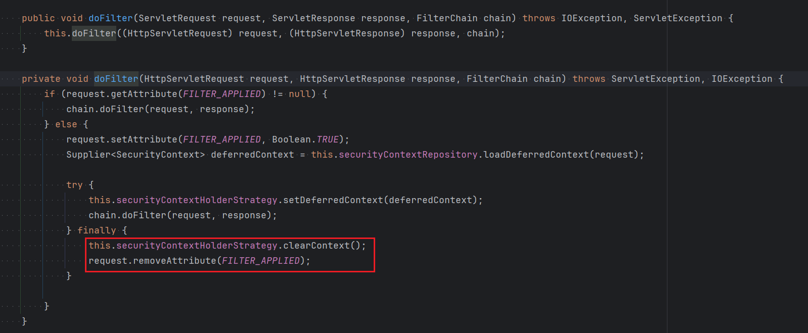
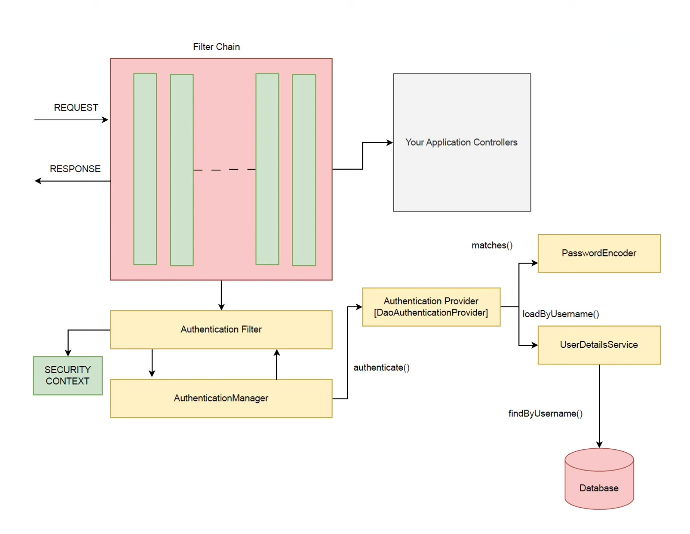
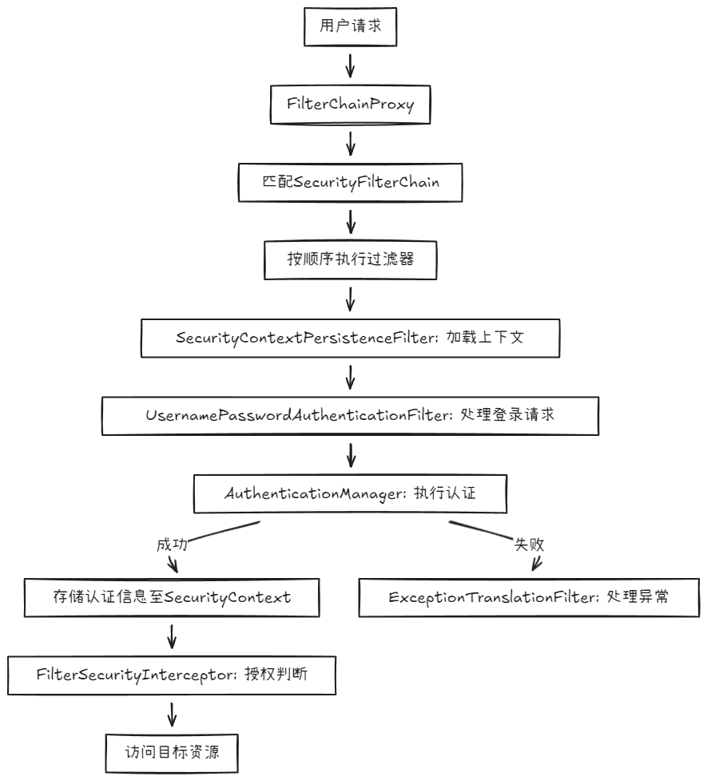

## 框架基础认知

### 什么是 Spring Security？

Spring Security 是 Spring 生态中的**应用程序安全框架**，核心功能是**认证（Authentication）** 和**授权（Authorization）**，同时提供丰富的安全防护机制。

简单说，它就像应用的 “门卫”：

- 先通过**认证**确认 “你是谁”；
- 再通过**授权**判断 “你能做什么”；
- 同时抵御 CSRF、XSS 等常见攻击。

其特点是与 Spring 框架（Boot、Cloud）深度集成，支持 “零配置” 快速启动，同时允许高度自定义以满足复杂场景。

### 认证与授权核心概念

#### 认证（Authentication）

即 “登录”，确认用户身份的过程。用户需提供凭证（如用户名 / 密码、Token），系统验证其有效性。

#### 授权（Authorization）

即 “权限判断”，确认已认证用户能执行哪些操作的过程。基于用户的角色或权限码，限制其访问资源（接口、页面等）。

**关系**：认证是授权的前提，先确认 “是谁”，再判断 “能做什么”。

### 为什么要用SpringSecurity？

无需重复开发认证授权逻辑，解决 “重复造轮子” 问题，同时提供：

- **全面安全防护**：内置 CSRF、XSS、会话固定攻击防御，支持 BCrypt 等强密码加密；
- **灵活授权机制**：支持 URL 级、方法级、数据级权限控制，适配 RBAC 模型（用户 - 角色 - 权限）；
- **生态无缝集成**：与 Spring Boot、Spring MVC 等自然融合，微服务中可轻松集成 OAuth2.0 实现统一认证 / 单点登录。

### 常见安全框架对比

|           | **Spring Security**                             | **Shiro**                | **Sa-Token**                    |
| --------- | ----------------------------------------------- | ------------------------ | ------------------------------- |
| **核心定位**  | 企业级安全框架，功能全面，侧重认证授权与安全防护                        | 轻量级安全框架，API 简洁，侧重易用性     | 轻量级 Java 权限认证框架，侧重快速开发          |
| **核心功能**  | 认证（表单、OAuth2、JWT 等）、授权（RBAC 等）、安全防护（CSRF、XSS 等） | 认证、授权、会话管理、加密            | 认证、授权、会话管理、单点登录、OAuth2 等        |
| **上手难度**  | 较高（概念多，配置复杂，需理解过滤器链、源码设计）                       | 中等（API 直观，配置简单，文档清晰）     | 低（API 极简，零配置启动，文档中文友好）          |
| **生态集成**  | 与 Spring 生态（Boot、Cloud）深度融合，无缝集成                | 可集成 Spring，但非专属，支持各种框架   | 支持 Spring、Spring Boot、SSM 等主流框架 |
| **扩展性**   | 极强（可自定义过滤器、认证 provider、决策管理器等）                  | 良好（支持自定义 realm、过滤器等）     | 良好（提供丰富的钩子方法，支持自定义扩展）           |
| **安全防护**  | 内置 CSRF、XSS、会话固定等攻击防护机制                         | 基础防护，需手动配置 CSRF 等防护      | 基础防护，需手动处理高级安全场景                |
| **分布式支持** | 原生支持 OAuth2.0、JWT，适合微服务架构                       | 需结合第三方组件（如 Redis）实现分布式会话 | 原生支持 Redis 分布式会话，适配微服务          |
| **学习资源**  | 官方文档详细，社区活跃，资料丰富（英文为主）                          | 文档清晰，中文资料较多，社区活跃度中等      | 中文文档完善，教程丰富，社区响应快               |
| **适用场景**  | 复杂企业级应用、微服务架构、需全面安全防护的场景                        | 中小项目、快速开发、对安全需求不复杂的场景    | 快速开发场景、中小项目、对易用性要求高的场景          |
| **典型优势**  | 功能全面，安全机制完善，微服务支持好                              | 轻量灵活，学习成本低，跨框架兼容性好       | 极简 API，开发效率高，中文支持友好             |
| **典型劣势**  | 学习曲线陡，配置繁琐，入门门槛高                                | 高级功能（如 OAuth2）需手动集成，生态较弱 | 社区规模较小，复杂场景解决方案较少               |

总结建议：

- **选 Spring Security**：若项目基于 Spring 生态（尤其是微服务），需要全面的安全防护（如 OAuth2、CSRF 防护），且能接受较高的学习成本。
- **选 Shiro**：若项目需要轻量级框架，希望快速上手，且对跨框架兼容性有要求（如非 Spring 项目）。
- **选 Sa-Token**：若追求极简 API 和开发效率，项目场景不复杂，且偏好中文文档和社区支持。

三者各有侧重，需根据项目规模、技术栈、安全需求综合选择。对于 Spring 技术栈的企业级应用，Spring Security 仍是主流选择。

## 核心组件

### UserDetails（用户信息载体）

- **定义**：封装用户核心信息的接口，是 Spring Security 内部识别用户的 “标准格式”。
- **核心属性 / 方法**：
    - `String getUsername()`：用户名（唯一标识，如账号、手机号）。
    - `String getPassword()`：加密后的密码（与前端传入的明文密码比对）。
    - `Collection<? extends GrantedAuthority> getAuthorities()`：用户拥有的权限集合。
    - `boolean isEnabled()`：账号是否可用（如禁用状态无法登录）。
    - 其他：`isAccountNonExpired()`（账号是否过期）、`isCredentialsNonExpired()`（密码是否过期）、`isAccountNonLocked()`（账号是否锁定）。
- **作用**：作为用户信息的 “统一协议”，连接开发者自定义的用户类与框架内部认证逻辑。开发者需通过实现类（如`User`默认实现）适配自己的用户表结构。

### UserDetailsService（用户信息加载接口）

- **定义**：加载用户信息的接口，是框架与 “用户数据源”（数据库、缓存等）的桥梁。
- **核心方法**：
	```java
	UserDetails loadUserByUsername(String username) throws UsernameNotFoundException;
	```
	- 入参：前端传入的用户名（或自定义唯一标识，如手机号）。
	- 返回：`UserDetails`对象（包含用户信息与权限）。
	- 异常：`UsernameNotFoundException`（用户不存在时抛出，将被框架捕获并转为 “认证失败”）。
- **作用**：在认证流程中，由`AuthenticationProvider`调用，根据用户名查询并返回用户信息，供后续密码比对使用。常见实现场景：从数据库查询用户后，封装为`UserDetails`返回。

### Authentication（认证信息载体）

- **定义**：封装认证过程中 “凭证信息” 与 “认证结果” 的接口，贯穿整个认证流程。
- **核心属性**：
    - `Object getPrincipal()`：用户身份（未认证时可能是用户名，认证后通常是`UserDetails`对象）。
    - `Object getCredentials()`：凭证（未认证时是明文密码，认证后通常被清空以保证安全）。
    - `Collection<? extends GrantedAuthority> getAuthorities()`：用户权限（认证成功后填充）。
    - `boolean isAuthenticated()`：是否已认证（框架通过此状态判断用户身份）。
- **常见实现类**：
    - `UsernamePasswordAuthenticationToken`：处理用户名密码认证的默认实现。
    - `JwtAuthenticationToken`：JWT 场景下的认证信息载体。
- **作用**：作为认证流程的 “数据容器”，从前端传入的凭证（如用户名密码）到认证成功后的用户信息，均通过此对象传递。

### AuthenticationManager（认证核心管理器）

- **定义**：认证流程的 “调度中心”，负责协调认证逻辑的执行。
- **核心方法**：
	```java
	Authentication authenticate(Authentication authentication) throws AuthenticationException;
	```
	- 入参：未认证的`Authentication`对象（如包含用户名密码的`UsernamePasswordAuthenticationToken`）。
	- 返回：已认证的`Authentication`对象（填充权限等信息）。
	- 异常：认证失败时抛出`AuthenticationException`（如密码错误、用户不存在）。
- **作用**：不直接执行认证，而是委托给一个或多个`AuthenticationProvider`（认证提供者），实现 “多种认证方式共存”（如同时支持用户名密码、手机号验证码登录）。
- **默认实现**：`ProviderManager`，内部维护一个`List<AuthenticationProvider>`，依次尝试认证直至成功或全部失败。

### AuthenticationProvider（认证执行者）

- **定义**：实际执行认证逻辑的接口，是`AuthenticationManager`的 “下属”。
- **核心方法**：
    - `Authentication authenticate(Authentication authentication)`：执行具体认证（如密码比对）。
    - `boolean supports(Class<?> authentication)`：判断当前`AuthenticationProvider`是否支持某种`Authentication`类型（如只处理`UsernamePasswordAuthenticationToken`）。
- **常见实现类**：
    - `DaoAuthenticationProvider`：默认处理用户名密码认证，内部会调用`UserDetailsService`加载用户信息，并通过`PasswordEncoder`比对密码。
    - `JwtAuthenticationProvider`：JWT 场景下验证 Token 合法性的提供者。
- **作用**：封装具体认证逻辑，使框架支持灵活扩展（如自定义认证方式时，只需实现此接口并注入`AuthenticationManager`）。

### SecurityContextHolder（安全上下文存储容器）

- **定义**：存储当前用户安全上下文（`SecurityContext`）的工具类，基于`ThreadLocal`实现。
- **核心方法**：
    - `SecurityContext getContext()`：获取当前线程的安全上下文。
    - `void setContext(SecurityContext context)`：设置安全上下文。
    - `void clearContext()`：清除当前线程的安全上下文（如登出时）。
- **作用**：在认证成功后，框架会将已认证的`Authentication`对象存入`SecurityContext`，再通过`SecurityContextHolder`绑定到当前线程。后续在任意位置（如 Controller、Service）可通过它获取当前登录用户信息：

```java
// 获取当前登录用户名  
String username = SecurityContextHolder.getContext()  
    .getAuthentication()  
    .getName();  
```

- **线程安全机制**：基于`ThreadLocal`实现线程隔离，确保多线程环境下（如 Web 容器的线程池）用户信息不会 “串线”。当请求的线程执行完成后，`FilterChainProxy`中的`SecurityContextHolderFilter`会清除`ThreadLocal`中的认证信息。

### GrantedAuthority（权限标识）

- **定义**：表示用户拥有的“权限”或“角色”的接口，是授权判断的核心依据。  
- **核心方法**：  
  ```java  
  String getAuthority(); // 返回权限字符串（如"ROLE_ADMIN"、"user:delete"）  
  ```  
- **常见实现类**：`SimpleGrantedAuthority`（直接存储权限字符串）。  
- **作用**：  
  - 在认证成功后，由`UserDetails.getAuthorities()`提供，存入`Authentication`对象。  
  - 授权时，框架通过比对资源所需权限与用户拥有的`GrantedAuthority`，决定是否允许访问（如`@PreAuthorize("hasAuthority('user:delete')")`）。  
- **角色与权限的关系**：角色本质是特殊的权限（默认以`ROLE_`为前缀，如`ROLE_ADMIN`），`hasRole("ADMIN")`等价于`hasAuthority("ROLE_ADMIN")`。  

### PasswordEncoder（密码加密器）  
- **定义**：处理密码加密与校验的接口，解决密码明文存储的安全问题。  
- **核心方法**：  
  - `String encode(CharSequence rawPassword)`：将明文密码加密（存储时调用）。  
  - `boolean matches(CharSequence rawPassword, String encodedPassword)`：校验明文密码与加密后密码是否匹配（登录时自动调用）。  
- **常见实现类**：  
  - `BCryptPasswordEncoder`（推荐）：基于BCrypt算法，自动生成随机盐值，加密后密码包含盐值（格式：`$2a$10$N9qo8uLOickgx2ZMRZo5MeVQ82i0j.nr6P50uM6MqQ66QoF9zqP4u`）。  
  - `NoOpPasswordEncoder`（不加密，仅用于测试，禁止生产环境使用）。  
- **作用**：避免密码明文存储，登录时框架会自动调用`matches`方法校验，开发者只需确保存储的是加密后的密码。

## 认证流程与过滤器链

### 总览图



### 完整认证流程

Spring Security 的认证流程是一个 “链式协作” 过程，涉及多个核心组件的联动。以**传统表单登录**为例，完整流程可拆解为 7 个关键步骤

#### 步骤 1：用户提交认证凭证

用户在登录页输入用户名 / 密码，通过 POST 请求提交至默认登录接口（`/login`）。此时请求中包含未认证的凭证信息（如`username=admin&password=123456`）。

#### 步骤 2：过滤器链拦截并提取凭证

请求进入 Spring Security 的过滤器链，由 **`UsernamePasswordAuthenticationFilter`**（表单登录核心过滤器）拦截。该过滤器：

  

- 检查请求路径是否为登录接口（默认`/login`，可自定义）。
- 从请求参数中提取用户名和密码（默认参数名`username`/`password`，可通过`usernameParameter()`配置修改）。
- 将凭证封装为**未认证的`Authentication`对象**（`UsernamePasswordAuthenticationToken`，`isAuthenticated=false`）。

#### 步骤 3：AuthenticationManager 调度认证

`UsernamePasswordAuthenticationFilter`将未认证的`Authentication`对象传递给 **`AuthenticationManager`**（认证管理器），调用其`authenticate()`方法触发认证逻辑。

  

`AuthenticationManager`本身不执行认证，而是委托给其管理的 **`AuthenticationProvider`**（认证提供者）：

  

- 通过`supports()`方法判断当前`AuthenticationProvider`是否支持处理`UsernamePasswordAuthenticationToken`类型（默认由`DaoAuthenticationProvider`处理）。
- 若支持，则调用`AuthenticationProvider.authenticate()`执行具体认证。

#### 步骤 4：AuthenticationProvider 执行认证逻辑

`DaoAuthenticationProvider`的认证过程分为 3 步：


1. **加载用户信息**：调用`UserDetailsService.loadUserByUsername()`，根据用户名从数据库 / 缓存中查询用户信息，返回`UserDetails`对象（包含加密后的密码、权限等）。
    
    - 若用户不存在，抛出`UsernameNotFoundException`，触发认证失败流程。
2. **密码比对**：通过`PasswordEncoder.matches(明文密码, 加密后密码)`比对用户输入的明文密码与`UserDetails`中存储的加密密码。
    
    - 若密码不匹配，抛出`BadCredentialsException`，触发认证失败流程。
3. **校验账号状态**：检查`UserDetails`的`isEnabled()`（账号是否可用）、`isAccountNonLocked()`（是否锁定）等状态，若状态异常则抛出对应异常（如`DisabledException`）。
    

#### 步骤 5：生成已认证的 Authentication 对象

若上述校验均通过，`AuthenticationProvider`生成**已认证的`Authentication`对象**：

- `principal`：填充为`UserDetails`对象（包含用户信息）。
- `credentials`：通常设为`null`（清空密码，避免泄露）。
- `authorities`：填充为`UserDetails.getAuthorities()`中的权限集合。
- `isAuthenticated`：设为`true`。

#### 步骤 6：存储认证结果至安全上下文

`AuthenticationManager`将已认证的`Authentication`对象返回给`UsernamePasswordAuthenticationFilter`，过滤器通过以下方式存储结果：

```java
// 将认证信息存入SecurityContext
SecurityContext context = SecurityContextHolder.createEmptyContext();
context.setAuthentication(authenticatedAuth);
SecurityContextHolder.setContext(context);
```

此时，`SecurityContextHolder`（基于`ThreadLocal`）将当前用户的认证信息与请求线程绑定，后续在 Controller/Service 中可直接通过`SecurityContextHolder`获取用户信息。

#### 步骤 7：认证成功 / 失败处理

- **成功**：由`AuthenticationSuccessHandler`处理（默认跳转至登录前的请求页面，或通过`defaultSuccessUrl()`配置固定跳转页）。
- **失败**：由`AuthenticationFailureHandler`处理（默认返回登录页并携带错误信息，或通过`failureUrl()`配置跳转页）。

### 过滤器链

Spring Security 的所有安全逻辑（认证、授权、异常处理等）均通过**过滤器链（Filter Chain）** 实现。过滤器链是一组按特定顺序执行的过滤器，每个过滤器负责处理特定的安全任务。
#### 过滤器链核心入口：FilterChainProxy

`FilterChainProxy`是 Spring Security 的 “总过滤器”，是所有安全请求的入口点，其核心作用是：

- 管理多个 “过滤器链”（`SecurityFilterChain`），每个链对应一组请求规则（如`/**`匹配所有请求）。
- 根据请求路径匹配对应的`SecurityFilterChain`，并按顺序执行链中的过滤器。

**配置示例**（Spring Boot 自动配置的默认链）：

```java
@Bean
public SecurityFilterChain securityFilterChain(HttpSecurity http) throws Exception {
    http  
        .authorizeHttpRequests(auth -> auth
            .anyRequest().authenticated() // 所有请求需认证
        )  
        .formLogin(withDefaults()); // 启用表单登录过滤器
    return http.build();
}
```

上述配置会生成一个`SecurityFilterChain`，包含表单登录所需的所有过滤器。

#### 关键过滤器及其职责（执行顺序从先到后）

| 过滤器名称                                     | 核心职责                                                                                                                         |
| ----------------------------------------- | ---------------------------------------------------------------------------------------------------------------------------- |
| `SecurityContextPersistenceFilter`        | **上下文持久化**：请求开始时从`HttpSession`加载`SecurityContext`到`SecurityContextHolder`；请求结束时将`SecurityContext`保存回`HttpSession`（仅针对有状态会话）。 |
| `UsernamePasswordAuthenticationFilter`    | **表单登录处理**：拦截登录请求，提取用户名密码，触发`AuthenticationManager`认证（见步骤 2）。                                                                |
| `BasicAuthenticationFilter`               | **Basic 认证处理**：拦截携带`Authorization: Basic`头的请求，提取用户名密码并认证（适用于简单 API 场景）。                                                      |
| `RequestCacheAwareFilter`                 | **请求缓存**：缓存未认证时的请求（如用户访问`/admin`被拦截至登录页，登录成功后自动跳转回`/admin`）。                                                                 |
| `SecurityContextHolderAwareRequestFilter` | **请求包装**：将`HttpServletRequest`包装为`SecurityContextHolderAwareRequestWrapper`，提供便捷方法（如`request.isUserInRole("ADMIN")`）。        |
| `ExceptionTranslationFilter`              | **异常转换**：捕获认证 / 授权过程中抛出的异常（如`AuthenticationException`），转换为对应的响应（如跳转登录页或返回 401）。                                              |
| `FilterSecurityInterceptor`               | **授权决策**：认证通过后，检查当前用户是否有权限访问请求资源（调用`AccessDecisionManager`执行授权判断）。                                                           |
#### 过滤器链执行流程图




### 过滤器链的灵活性

Spring Security 的过滤器链设计支持灵活扩展，以适应不同场景：

- **自定义过滤器**：
	- 通过`http.addFilterBefore(customFilter, UsernamePasswordAuthenticationFilter.class)`将自定义过滤器插入到指定过滤器之前（如 JWT 认证需在`UsernamePasswordAuthenticationFilter`之前添加`JwtAuthenticationFilter`）
	- 通过`http.addFilterAfter(customFilter, UsernamePasswordAuthenticationFilter.class)`插入到指定过滤器之后（如认证成功后的日志记录过滤器）
	- 通过`http.addFilterAt(customFilter, UsernamePasswordAuthenticationFilter.class)`插入到与指定过滤器相同的位置（通常用于替换原有过滤器逻辑）。
- **多过滤器链**：通过`@Bean`定义多个`SecurityFilterChain`，并通过`requestMatchers()`指定各自匹配的路径（如`/api/**`使用 JWT 过滤器链，`/admin/**`使用表单登录过滤器链）。

### 总结

认证流程的本质是 “过滤器链驱动组件协作” 的过程：

- 过滤器链负责拦截请求、调度认证逻辑、处理结果；
- `AuthenticationManager`与`AuthenticationProvider`负责核心认证逻辑；
- `SecurityContextHolder`负责存储认证结果，为后续授权提供依据。

理解过滤器的执行顺序和职责，是自定义安全逻辑（如集成 JWT、社交登录）的基础 —— 只需在合适的位置插入自定义过滤器，即可无缝接入 Spring Security 的流程。
