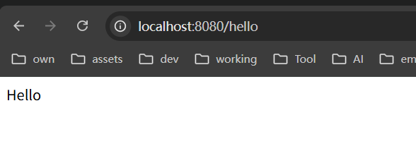
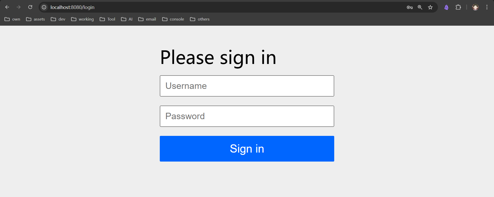
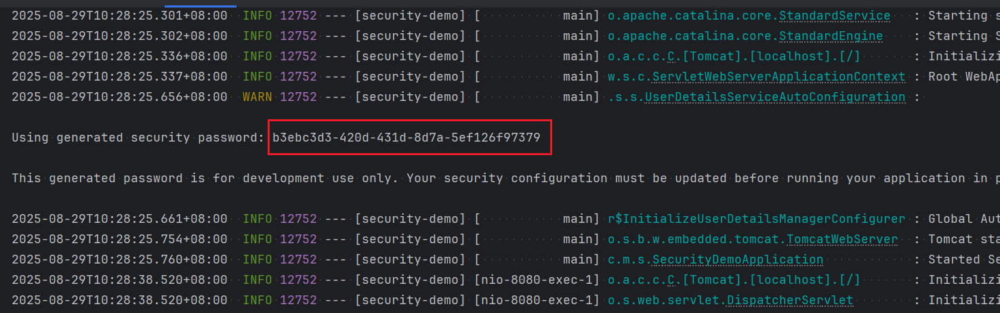
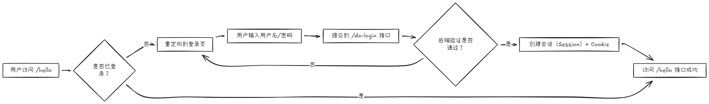
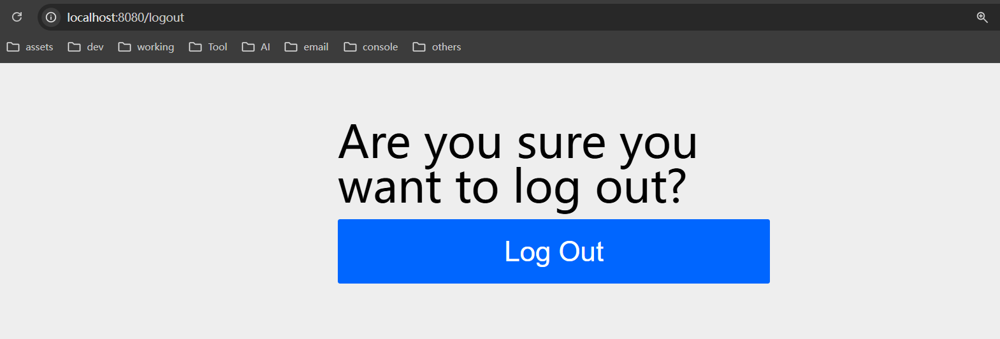
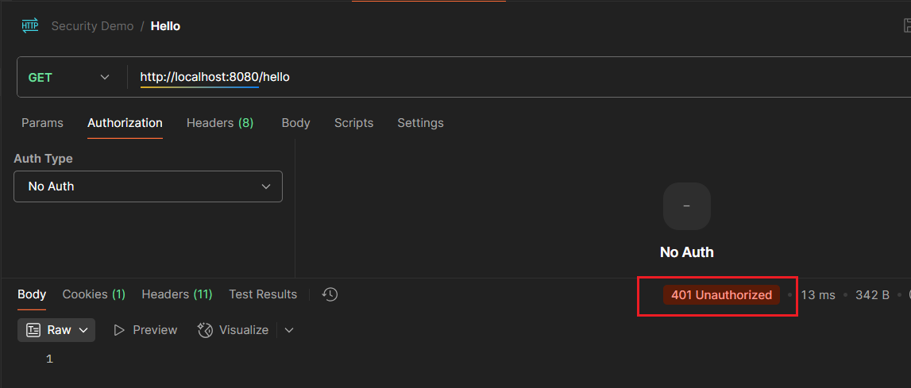
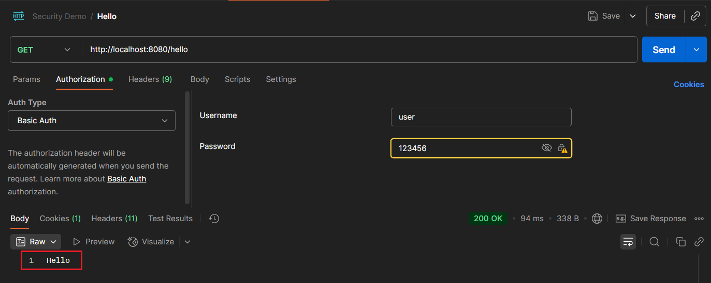
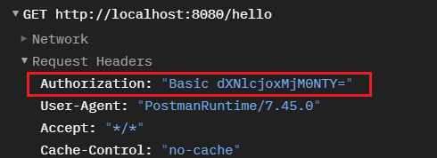
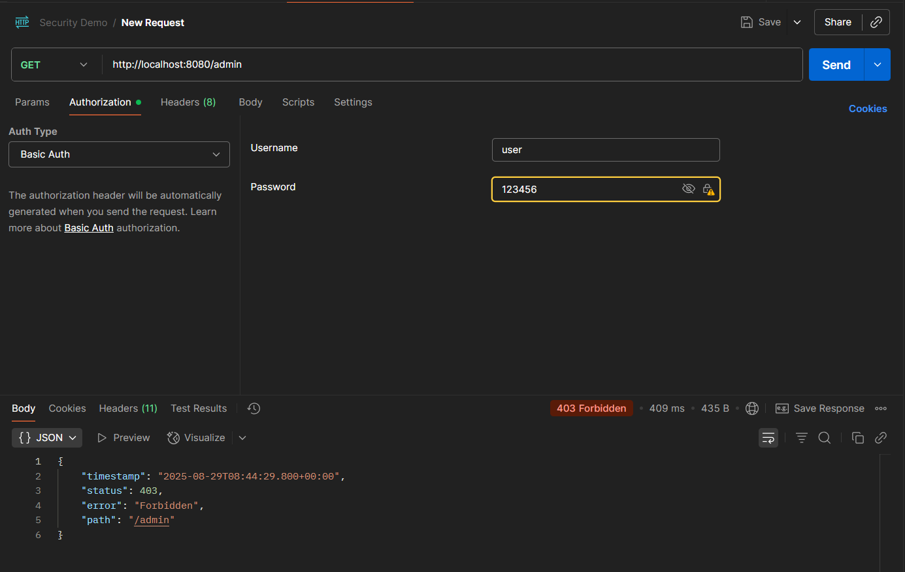

## 默认安全控制

###  环境准备

创建基础 Spring Boot 项目，编写测试接口：

```java
import org.springframework.web.bind.annotation.GetMapping;  
import org.springframework.web.bind.annotation.RestController;  

@RestController  
public class Hello {
    @GetMapping("hello")
    public String hello() {
        return "Hello";
    }
}
```

启动项目后，访问[http://localhost:8080/hello](http://localhost:8080/hello)可直接返回结果（无安全控制）。



### 体验 Spring Security 默认安全控制

#### 引入依赖（开启安全功能）

在 `pom.xml` 中添加 Spring Security Starter，依赖引入后会**自动启用默认安全配置**：

```xml
<dependency>  
    <groupId>org.springframework.boot</groupId>  
    <artifactId>spring-boot-starter-security</artifactId>  
</dependency>
```

#### 默认拦截逻辑

重新启动项目，访问 `http://localhost:8080/hello`，会发现：

1. 请求被自动拦截，重定向到 Spring Security 内置的默认登录页；
2. 默认用户名固定为 `user`，密码会随机生成并打印在控制台（格式：`Using generated security password: xxxxx`）
3. 输入正确的用户名 / 密码后，才能正常访问 `/hello` 接口。

**核心认知**：Spring Security 会默认保护所有接口，未认证请求必须先完成登录。

## 表单登录

表单登录是 Web 应用最基础的认证交互方式，通过 “登录页面收集凭证→后端验证→创建会话” 实现安全控制。

### 默认表单登录

无需额外配置，依赖引入后即启用默认表单登录，核心流程：

- 未认证请求 → 重定向到 `/login`（默认登录页路径）；
- 提交用户名 / 密码 → 后端验证（默认校验内存中的 `user` 用户）；
- 验证成功 → 跳转回原请求接口（或默认页面）；
- 验证失败 → 停留在登录页并提示错误。

### 自定义表单登录

若需修改默认登录页、提交路径等，可通过 `SecurityFilterChain` 配置：

```java
import org.springframework.security.config.Customizer;
import org.springframework.security.config.annotation.web.builders.HttpSecurity;
import org.springframework.security.config.annotation.web.configuration.EnableWebSecurity;
import org.springframework.security.web.SecurityFilterChain;
import org.springframework.context.annotation.Bean;
import org.springframework.context.annotation.Configuration;

@Configuration  
@EnableWebSecurity  // 开启 Spring Security 自定义配置
public class SecurityConfig {  

    // 配置安全过滤链：自定义表单登录逻辑
    @Bean  
    SecurityFilterChain securityFilterChain(HttpSecurity http) throws Exception {  
        http
            // 1. 所有接口需认证（未登录则拦截）
            .authorizeHttpRequests(auth -> auth.anyRequest().authenticated())
            // 2. 配置表单登录（替换部分默认逻辑）
            .formLogin(form -> form
                .loginPage("/my-login.html")  // 自定义登录页路径（需自己编写页面）
                .loginProcessingUrl("/do-login")  // 登录表单提交的后端接口路径
                .defaultSuccessUrl("/hello")  // 登录成功后默认跳转的接口
            );  

        return http.build();  
    }  
}
```

### 表单登录的核心交互逻辑



### 登出

访问http://localhost:8080/logout，点击Log Out



## HTTP Basic 认证

HTTP Basic 认证是一种简单的 “无会话” 认证方式，通过请求头传递凭证，常用于 API 测试或简单接口（**不推荐生产环境直接使用**）。

### 启用 Basic 认证

```java
@Bean  
SecurityFilterChain securityFilterChain(HttpSecurity http) throws Exception {  
    http
        .authorizeHttpRequests(auth -> auth.anyRequest().authenticated())
        // 启用 HTTP Basic 认证（可与表单登录并存）
        .httpBasic(Customizer.withDefaults());  

    return http.build();  
}
```

### 体验 Basic 认证流程

使用postman进行演示

未携带凭证时，后端返回 `401 Unauthorized` 状态码，响应头包含 `WWW-Authenticate: Basic realm="Realm"`（提示客户端需提供 Basic 凭证）



选择认证方式为Basic Auth，填写用户名密码，访问成功



可以看到请求头里有Authorization: "Basic dXNlcjoxMjM0NTY="。



将dXNlcjoxMjM0NTY=使用base64解密后发现，是这样的：user:123456，所以一般的登录都是不安全的，不推荐这样做。

## 自定义内存用户

在配置文件中定义，这种只能定义一个

```yaml
spring:
  security:
    user:
      name: user
      password: 123456
      roles: USER
```

在配置类中定义，可定义多个

```java
@Configuration  
@EnableWebSecurity  
public class SecurityConfig {  
    @Bean  
    SecurityFilterChain securityFilterChain(HttpSecurity http) throws Exception {  
        http.authorizeHttpRequests((requests) -> ((AuthorizeHttpRequestsConfigurer.AuthorizedUrl) requests.anyRequest()).authenticated());  
        // http.formLogin(Customizer.withDefaults());  
        http.httpBasic(Customizer.withDefaults());  
        return (SecurityFilterChain) http.build();  
    }  
  
    @Bean  
    public UserDetailsService userDetailsService() {  
        UserDetails user = User.withUsername("user")  
                .password("{noop}123456")  
                .roles("USER")  
                .build();  
  
        UserDetails admin = User.withUsername("admin")  
                .password("{noop}admin123")  
                .roles("ADMIN")  
                .build();  
        // 使用内存存储用户信息  
        return new InMemoryUserDetailsManager(user, admin);  
    }  
}
```


## 权限控制

在配置类上添加`@EnableMethodSecurity`注解

在方法上添加注解

```java
@RestController  
public class Hello {  
    @GetMapping("hello")  
    public String hello() {  
        return "Hello";  
    }  
  
    @GetMapping("user")  
    @PreAuthorize("hasRole('USER')")  
    public String user(){  
        return "hello user";  
    }  
  
    @GetMapping("admin")  
    @PreAuthorize("hasRole('ADMIN')")  
    public String admin(){  
        return "hello admin";  
    }  
}
```

当我们使用user访问admin接口时或者使用admin访问user接口时都会被拦截，如下图所示




## 加盐加密


Spring Security 要求密码必须加密存储，通过密码编码器（`PasswordEncoder`）实现。

### 密码前缀规则

密码字符串的**前缀**用于指定加密算法（由 `DelegatingPasswordEncoder` 管理），常见前缀：

|前缀|对应的编码器|说明|
|---|---|---|
|`{noop}`|`NoOpPasswordEncoder`|不加密（明文），仅用于开发测试，禁止生产使用|
|`{bcrypt}`|`BCryptPasswordEncoder`|使用 BCrypt 算法加密（推荐生产使用）|
|`{pbkdf2}`|`Pbkdf2PasswordEncoder`|使用 PBKDF2 算法加密|
|`{scrypt}`|`SCryptPasswordEncoder`|使用 SCrypt 算法加密|
|`{sha256}`|`MessageDigestPasswordEncoder`|使用 SHA-256 哈希（不推荐，安全性较低）|
|`{argon2}`|`Argon2PasswordEncoder`|使用 Argon2 算法加密（较新的高强度算法）|

**注意**：若密码无前缀，会报错 `java.lang.IllegalArgumentException: There is no PasswordEncoder mapped for the id "null"`。

### 配置加密方式

显示指定加密方式后，密码就不需要加前缀了。推荐使用 BCrypt 加密，示例如下：

```java
@Configuration  
@EnableWebSecurity  
public class SecurityConfig {  
    @Bean  
    SecurityFilterChain securityFilterChain(HttpSecurity http) throws Exception {  
        http.authorizeHttpRequests((requests) -> ((AuthorizeHttpRequestsConfigurer.AuthorizedUrl) requests.anyRequest()).authenticated());  
        // http.formLogin(Customizer.withDefaults());  
        http.httpBasic(Customizer.withDefaults());  
        return (SecurityFilterChain) http.build();  
    }  
  
    @Bean  
    public UserDetailsService userDetailsService() {  
        UserDetails user = User.withUsername("user")  
                .password(passwordEncoder().encode("123456"))  
                .roles("USER")  
                .build();  
  
        UserDetails admin = User.withUsername("admin")  
                .password(passwordEncoder().encode("admin123"))  
                .roles("ADMIN")  
                .build();  
        // 使用内存存储用户信息  
        return new InMemoryUserDetailsManager(user, admin);  
    }  
  
    @Bean  
    public PasswordEncoder passwordEncoder() {  
        return new BCryptPasswordEncoder();  
    }  
}
```

### 加盐加密原理

**为什么需要加盐？**  
若直接对明文密码哈希，相同密码会生成相同哈希值，易被 “彩虹表” 破解。加盐后，即使密码相同，哈希结果也不同。

**什么是加盐？盐是什么？**  
“盐” 是一段**随机生成的字符串**，通常是16位，32位。
- **随机性**：每个用户的密码对应一个唯一的盐（即使密码相同，盐也不同）；
- **公开存储**：盐不需要保密，会和最终的哈希值一起存到数据库（比如存到`password`字段，或单独用`salt`字段存储）；
- **不可重复**：同一系统内，盐最好不重复（避免极端情况下的碰撞风险）。

**BCrypt 加密流程**：

1. 调用 `passwordEncoder.encode("123456")` 时，自动生成随机盐；
2. 自动将“明文密码”+“盐”混合后进行哈希计算
3. BCrypt会按固定格式把盐藏在哈希值里（算法版本+工作因子+盐+纯哈希结果）
4. 加密完成

**验证流程**：

1. 从存储的哈希值中提取盐；
2. 用盐与用户输入的明文密码重新计算哈希；
3. 对比两次哈希结果，一致则验证通过。

**格式说明**：`$2a$10$QJfLupeMwwX7w5wPr9RNPe1NZsPgINeVNV/kBZ/qBlVtxB6YY57UK`  
按 `$` 分割后分为 4 部分：
- `2a`：BCrypt 的版本号（算法标识）；
- `10`：工作因子（迭代次数，影响加密强度）；
- `QJfLupeMwwX7w5wPr9RNPe`：自动生成的盐（22 个字符，实际是 16 字节的二进制数据经 Base64 编码后的结果）；
- `1NZsPgINeVNV/kBZ/qBlVtxB6YY57UK`：明文密码 + 盐混合后哈希处理的结果。

混合规则是固定的，是算法内置的，所以，同样的盐和同样的密码进行混合，得到的哈希结果完全一致
